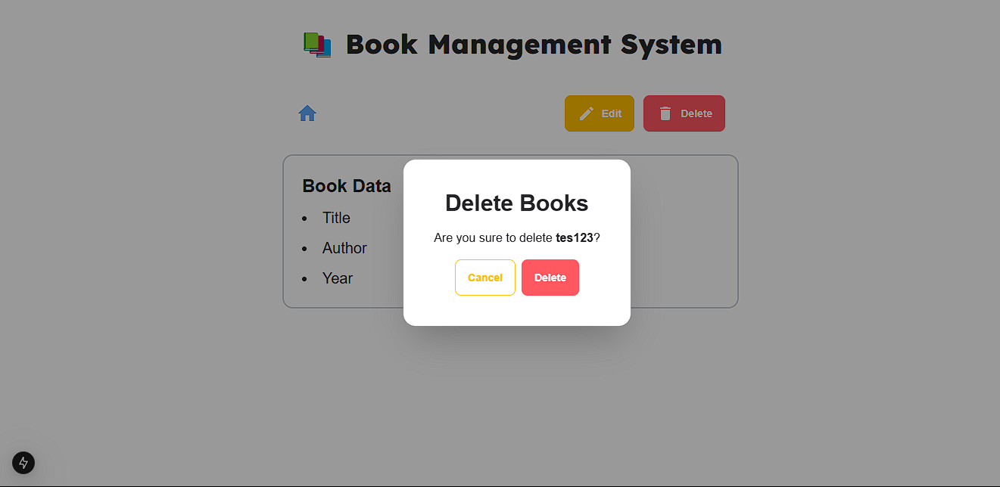

# Sensync-Book-Management

API Documentation : https://documenter.getpostman.com/view/8765062/2sAYJ3Eh7q

# Screenshots

## Home ("/")

## Home Empty

## Form Add

## Success Alert

## Details ("/details/{id}")

## Form Edit

## Delete Button

## Details Error

## Error Handler

## Invalid Route

